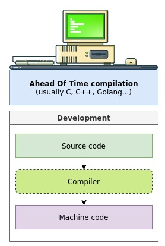
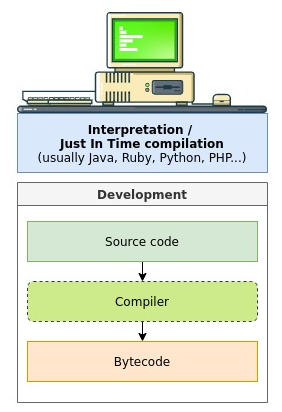

# Лекция 0.  Алгоритмы, задачи, вычислительные машины.

## Секция 3 - Алгоритмы и программы

Алгоритмы являются подробными и точными инструкциями по решению какой-либо задачи.

Важно, что каждый алгоритм предназначается для некоторого исполнителя. 

 В реальной жизни исполнителями как правило являются люди или вычислительные машины. Например, инструкция по сборке мебели - это алгоритм предназначаемый для исполнителя-человека.

Однако, самые сложные задачи, связанные с обработкой, хранением и передачей информации  человек умышленно поручил вычислительным машинам.

К сожалению или к счастью, вычислительные машины не способны понимать и использовать человеческий язык. И даже учитывая что в современном мире быстро развивается распознавания речи и языковые модели, внутри вычислительные машины все равно оперируют лишь двумя состояниями - наличием тока или его отсутствием.

Эта физическая сущность компьютеров заставила людей широко использовать двоичную систему счисления или **двоичный код**.

Люди формулируют алгоритмы на понятном им языке, а компьютеры на языке двоичной системы счисления - с помощью нулей и единиц. Для формализации и описания алгоритмов в более понятной для вычислительных машин манере были созданы **языки программирования**.

Алгоритм решения задачи, записанный на конкретном языке программирования называется **программой**. То есть, программа это более узкое понятие, а алгоритм более широкое. Программа - это один из способов записи алгоритма.

**Программа** – набор инструкций на специальном языке, которые могут быть выполнены компьютером.

Языки программирования можно условно разделить на несколько категорий.

### Машинный язык (machine language)

Программа на машинном языке читается компьютером напрямую, без промежуточных шагов.

Программа в машинном коде состоит из последовательности машинных инструкций в двоичном коде, которые содержат коды операций и ячейки памяти, участвующие в операции.

**Изображение 0.3.0 - Пример машинного кода**

**Источник: https://learnlearn.uk/gcsecs/theory/algorithms/the-3-levels-of-code/**

Двоичный код отличается большим объемом, поэтому чаще используют укороченную запись - hex код, тоже самое, но записанное в 16-ричной системе счисления.

**Изображение 0.3.1 - Пример машинного кода в hex (не hex код примера 0.3.1)**

**Источник: https://learnlearn.uk/gcsecs/theory/algorithms/the-3-levels-of-code/**

### Язык ассемблера (assembly language)

Символьное представление машинного языка конкретного процессора.

Преобразуется в машинный код ассемблером.

Обычно каждая строка кода сборки производит одну машинную инструкцию (однозначное соответствие).

Программирование на ассемблере медленное и подвержено ошибкам, но более эффективно с точки зрения производительности оборудования.

**Изображение 0.3.2 -  Пример кода на языке ассемблера**

### Языки программирования высокого уровня (high-level programming languages)

Языки программирования, в котором используются операторы, состоящие из похожих на английские ключевых слов, таких как «FOR», «PRINT» или «IF».

Каждое утверждение соответствует нескольким инструкциям машинного языка.

**Изображение 0.3.3 - Пример кода на языке ассемблера**

На данные ссылаются, используя описательные символьные имена, которые называются **имена переменных**.

### Трансляция

**Транслятор** – программа, обеспечивающая перевод написанного нами исходного кода на внутренний язык компьютера. 

Обычно выделяют трансляторы двух типов.

#### Компилятор

**Компилятор** - осуществляет перевод всего исходного кода на машинный язык, сразу проверяет его корректность.

Известные компилируемые языки – С/C++, Golang

**Изображение 0.3.4 - Написание кода + компиляция**

**Изображение 0.3.5 - Выполнение кода машиной **

#### Интерпретатор

**Интерпретатор** - поочередно переводит каждый оператор исходной программы на машинный язык и немедленно выполненяет его с одновременной проверкой правильности.

Известные интерпретируемые языки программирования - Python, Java.

**Изображение 0.3.6 - Написание кода + компиляция**

**Изображение 0.3.7 - Выполнение кода машиной**

### Компиляция в C++

**Изображение 0.3.8 - Процесс создания исходного кода в компилируемых языках C/C++ (случай статической компоновки)**

## Вопросы

- **Вопрос 1.** Код, написанный на каком языке, будет работать быстрее: на компилируемом или интерпретируемом?

- **Вопрос 2.** В чем может быть преимущество интерпретируемых языков над компилируемыми?

- **Вопрос 3.** В каком коде легче искать ошибки - в коде компилируемых ЯП или интерпретируемых?
 
  
## Ссылки
#TODO: Добавить ссылки

[1] --------------------

[2] --------------------

[3] --------------------
