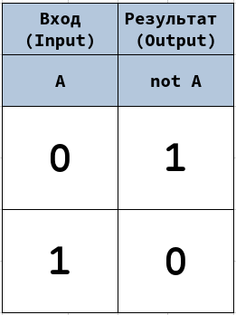

# Лекция 0.  Алгоритмы, задачи, вычислительные машины.

## Секция 5 -  Двоичные операторы

Из школьных курсов все мы помним о существовании булевых операций, таких как конъюнкция (AND), дизъюнкция (OR), отрицание (NOT) и исключающее или (XOR).

Вспомним как формулируются эти операции.

### Основные логические операции


**Изображение 0.4.0 - Логическое И - Конъюнкция - AND**

**Источник: этот курс**


**Изображение 0.4.0 - Логическое ИЛИ - Дизъюнкция - OR**

**Источник: этот курс**



**Изображение 0.4.0 - Логическое НЕ - Отрицание - NOT**

**Источник: этот курс**


**Изображение 0.4.0 - Исключающее ИЛИ - XOR**

**Источник: этот курс**


### Двоичные операторы в программировании

Как мы уже обсудили, все данные хранятся в компьютерах в виде последовательности бит или двоичных последовательностях.

Для удобства задания в виде двоичной последовательности существуют двоичные литералы.

```
a = 0   # 0b0
a = 1   # 0b1
a = 2   # 0b10
a = 10  # 0b1010
a = 255 # 0b11111111
```
**Код 0.4.0 - Пример двоичных литератов**

**Источник: этот курс**

В большинстве языков программирования реализованы двоичные операторы. Двоичные операторы применяют упомянутые выше логические операции не к одному биту, а сразу к целой последовательности бит.


```
a = 5     # 0b101
b = 6     # 0b110

c = a & b # 0b100 == 4
d = a | b # 0b111 == 7
e = a ^ b # 0b11 == 3
f =  ~ a  # 0b1...11111010 == -6
```

**Код 0.4.0 - Пример двоичных операторов**

**Источник: этот курс**

#### Двоичные сдвиги (binary shift)
#### Битовые маски (bit mask)

### Примеры задач

**Задача про пары чисел**
Дана последовательность **A** из **n** различных целых чисел. Про последовательность известно, что каждое число кроме одного встречается в ней дважды. Найдите число, у которого нет пары.

Количество дополнительной памяти, используемой алгоритмом, не должно превышать 1MB.

**Ограничения на входные данные:**

$$\LARGE n \in \mathbb{N}, \quad 1 \leq n \leq 10^{9}$$

$$\LARGE A = a_{1}, a_{2}, ... , a_{n}$$

$$\LARGE 10^{-9}\leq a_i \leq 10^{9} \quad\quad \forall i \in \mathbb{N},\quad 1 \leq i \leq n$$

**Выходные данные:**

В качестве ответа необходимо вернуть единственное число - число, которое встречается в последовательности ровно 1 раз.

#TODO: Добавить разбор


------------

## Вопросы

- **Вопрос 1.** #TODO: Добавить вопрос 1

- **Вопрос 2.** #TODO: Добавить вопрос 2
 
  
## Ссылки

[1] ---------------

[2] ---------------

[3] ---------------


