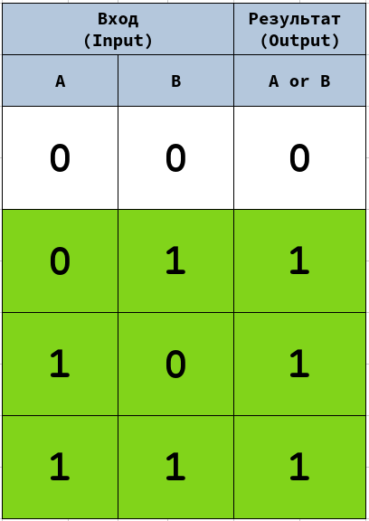
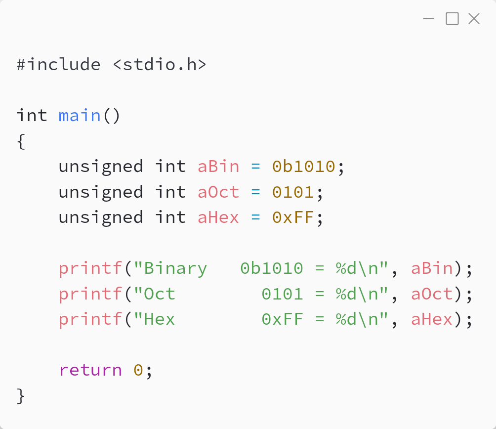
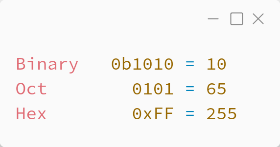
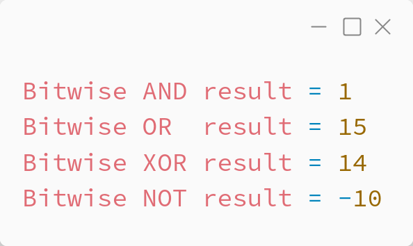
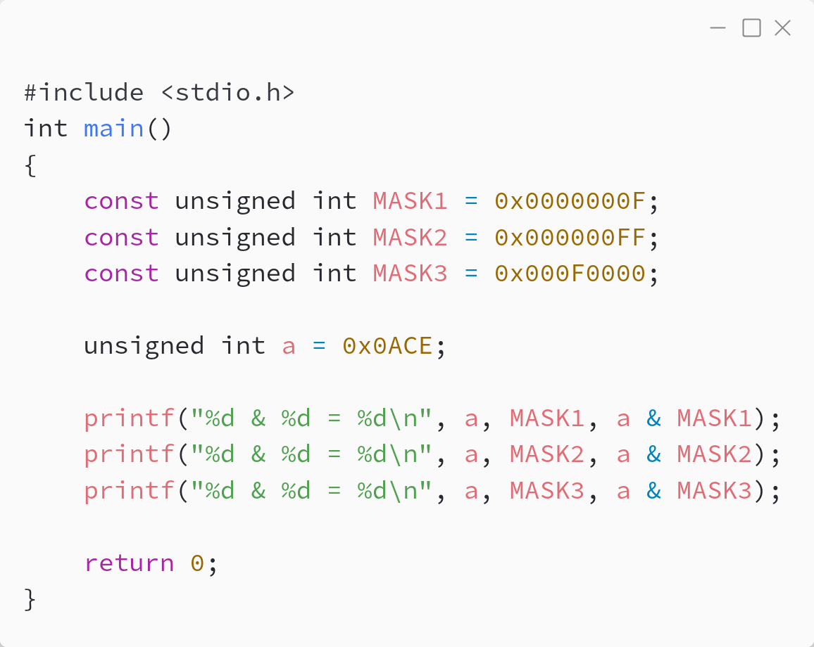
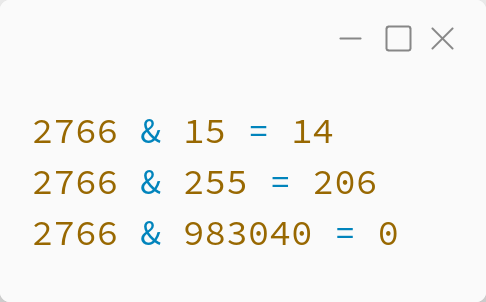
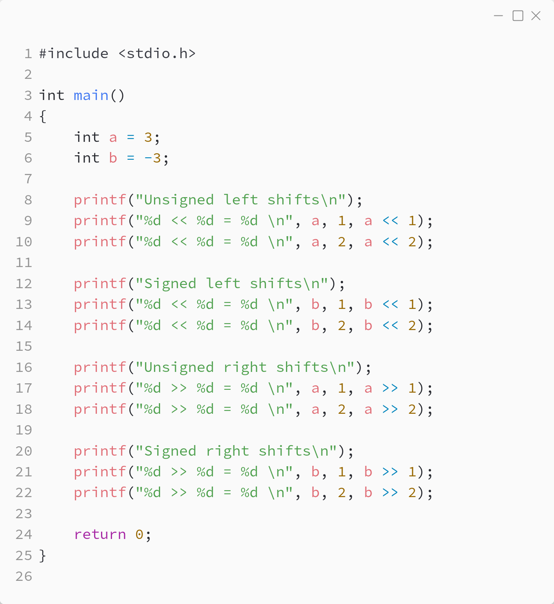
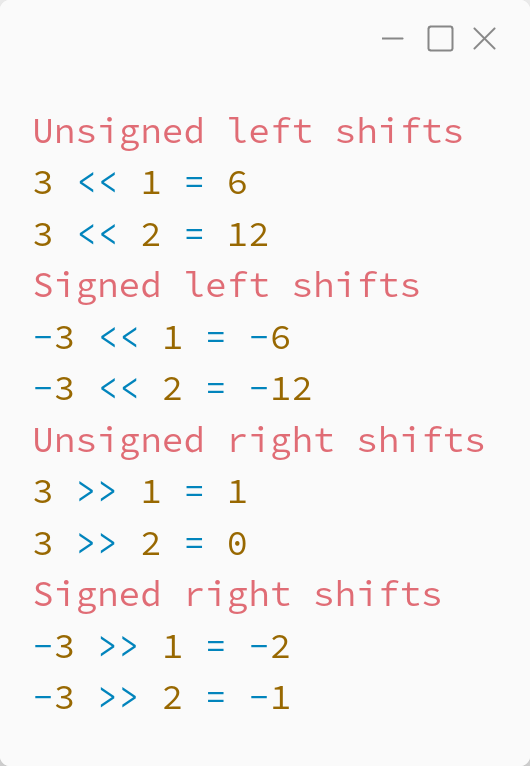

# Лекция 0.  Алгоритмы, задачи, вычислительные машины.

## Секция 5 -  Двоичные операторы

Из школьных курсов все мы помним о существовании булевых операций, таких как конъюнкция (AND), дизъюнкция (OR), отрицание (NOT) и исключающее или (XOR).

Вспомним как формулируются эти операции.

### Основные логические операции

#### Логическое И (AND) - Конъюнкция

**Изображение 0.4.0 - Логическое И - Конъюнкция - AND**

**Источник: этот курс**

#### Логическое ИЛИ(OR) - Дизъюнкция

**Изображение 0.4.0 - Логическое ИЛИ - Дизъюнкция - OR**

**Источник: этот курс**

#### Логическое исключающее ИЛИ(XOR)

**Изображение 0.4.0 - Исключающее ИЛИ - XOR**

**Источник: этот курс**

#### Логическое отрицание (NOT)

**Изображение 0.4.0 - Логическое НЕ - Отрицание - NOT**

**Источник: этот курс**

### Двоичные операторы в программировании

Как мы уже обсудили, все данные хранятся в компьютерах в виде последовательности бит (двоичных последовательностях).

Для удобства работы с числами языки программирования обычно содержат разные варианты задания числовых констант (литералов). 

**Изображение 0.4.0 - Пример числовых литералов**

**Источник: этот курс**

**Изображение 0.4.0 - Пример числовых литералов (результат)**

**Источник: этот курс**

В большинстве языков программирования реализованы побитовые операторы. Побитовые операторы применяют упомянутые выше логические операции не к одному биту, а сразу к целой последовательности бит.

#TODO: В примере выше вывод обусловлен %d в выводе, надо либо поменять тип на инт, либо спецификатор на ul

**Изображение 0.4.0 - Пример двоичных операторов**

**Источник: этот курс**

**Изображение 0.4.0 - Пример двоичных операторов (результат)**

**Источник: этот курс**

В случае операции побитового отрицания (NOT) над знаковыми типами результат может изменить знак.

#### Битовые маски (bit mask)

Битовая маска - это специальное число, которое используется для работы с конкретными битами рассматриваемых данных. Такой способ работы приносит компактность и элегантность некоторых операций.

**Изображение 0.4.0 - Пример двоичной маски**

**Источник: этот курс**

**Изображение 0.4.0 - Пример двоичной маски (результат)**

**Источник: этот курс**

#### Двоичные сдвиги (binary shifts)

**Код 0.4.0 - Пример двоичных сдвигов**

**Источник: этот курс**

**Изображение 0.4.0 - Пример двоичных сдвигов (результат)**

**Источник: этот курс**

### Примеры задач

**Задача про пары чисел**
Дана последовательность **A** из **n** различных целых чисел. Про последовательность известно, что каждое число кроме одного встречается в ней дважды. Найдите число, у которого нет пары.

Количество дополнительной памяти, используемой алгоритмом, не должно превышать 1MB.

**Ограничения на входные данные:**

$$\LARGE n \in \mathbb{N}, \quad 1 \leq n \leq 10^{9}$$

$$\LARGE A = a_{1}, a_{2}, ... , a_{n}$$

$$\LARGE 10^{-9}\leq a_i \leq 10^{9} \quad\quad \forall i \in \mathbb{N},\quad 1 \leq i \leq n$$

**Выходные данные:**

В качестве ответа необходимо вернуть единственное число - число, которое встречается в последовательности ровно 1 раз.

#TODO: Добавить разбор

------------

## Вопросы

- **Вопрос 1.** #TODO: Добавить вопрос 1

- **Вопрос 2.** #TODO: Добавить вопрос 2
 
  
## Ссылки

[1] ---------------

[2] ---------------

[3] ---------------

