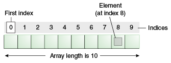
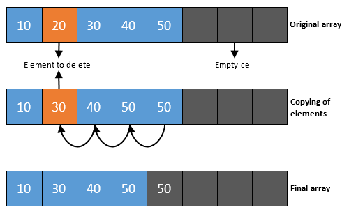
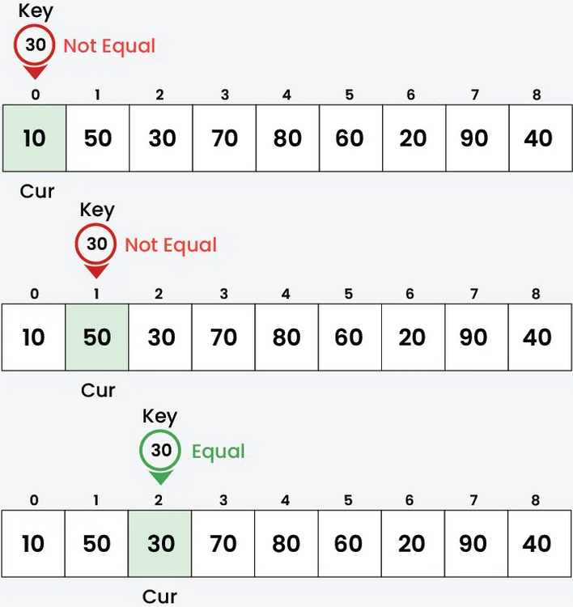
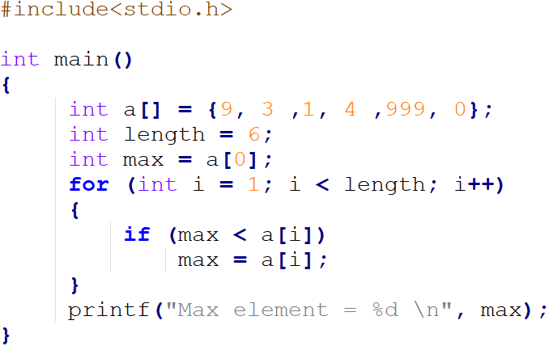

# Лекция 1.  Массивы, вычислительная сложность, тестирование.

## Часть 1 - Структура данных: массив

В большинстве случаев объем данных, обрабатываемых алгоритмам, достаточно велик, что не позволяет ограничиваться только использованием переменных (если конечно вы не решаете только задачи типа “A+B Problem”).

В таких случаях на помощь приходят разнообразные структуры данных.

Структура данных — это контейнер, который хранит данные и обеспечивает работу с ними в соответствии с определенными правилами.

Первая и самая простая структура данных (часто ее даже не относят к структурам данных), которую мы рассмотрим, называется массив.

Массив - это структура данных, для которой характерно:

1. Хранение элементов одного типа 
2. Размещение элементов последовательно в памяти
3. Единое имя для всех элементов

Полезно думать о массиве как об определенном наборе переменных одного типа.

**Имя массива** указывает на адрес в памяти его самого первого элемента. Доступ к элементам массива осуществляется с помощью **индексов** или **смещений**. Самый первый элемент имеет **нулевое смещение** относительно адреса массива в памяти.

**Изображение 1.0 - Структура данных масси и её устройство**

**Источник: -**

Пример работы с массивами

**Изображение 1.1 - Пример работы с массивом**

**Источник: **

Алгоритмы для работы с массивами:

- вставка/удаление/замена элементов
- поиск элемента
- поиск элемента с заданными свойствами
- сортировка массива

### Чтение/запись элемента

**Входные данные:** массив, позиция для чтения/вставки
**Результат:** элемент на запрашиваемой позиции или измененный массив

**Изображение 1.2 - Вставка элемента в массив**

**Источник: **

### Вставка элемента

**Входные данные:** массив, элемент для вставки, позиция для вставки
**Результат:** массив с вставленным элементов

**Изображение 1.2 - Вставка элемента в массив**

**Источник: **

### Удаление элемента

Удаление элемента

Входные данные: массив, позиция удаляемого элемента
Результат: массив без удаленного элемента

**Изображение 1.3 - Удаление элемента из массива**

**Источник: **

### Поиск вхождения элемента (linear search)

Входные данные: массив, искомый элемент
Результат: индекс искомого элемента, если он есть в массиве
Сложность в худшем случае: O(n)

**Изображение 1.4 - Поиск вхождения элемента в массив**

**Источник: **

### Поиск элемента с заданными свойствами

Входные данные: массив, критерии поиска
Результат: индекс искомого элемента, если он есть в массиве
Сложность в худшем случае: O(n)

**Изображение 1.4 - Поиск элемента с заданными свойствами в массиве**

**Источник: **

### Многомерные массивы 

**Изображение 1.4 - Пример многомерного массива**

**Источник: **

**Изображение 1.4 - Пример многомерного массива 2**

**Источник: https://overiq.com/c-programming-101/array-of-pointers-to-strings-in-c/ **

Row-major и column-major массивы

![[array_rowcolumn.png]]

**Изображение 1.4 - Row-major и column-major огранизация массива**

**Источник: https://craftofcoding.wordpress.com/2017/02/03/column-major-vs-row-major-arrays-does-it-matter/**

### Динамические массивы

Под динамическими массивами обычно имеют ввиду:

массивы, размер которых не известен заранее, память для них выделяется на этапе работы программы

структуры данных, имеющих внутри массивы и реализующие специальную логику по автоматическому увеличению их размера при необходимости

**Изображение 1.4 - Пример многомерного массива 2**

### Сложность операций в массивах

![[array_complexity_table.png]]

### Преимущества и недостатки массивов

![[array_pros_cons.png]]