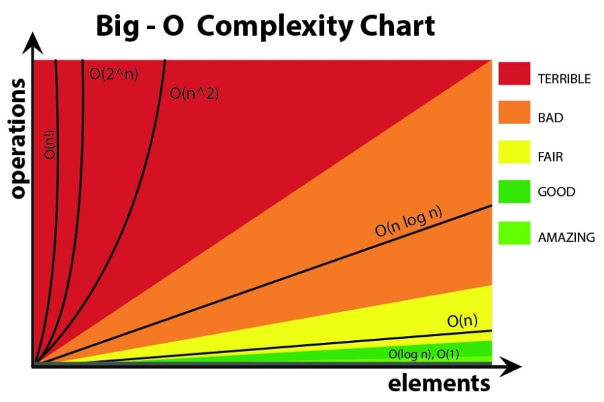
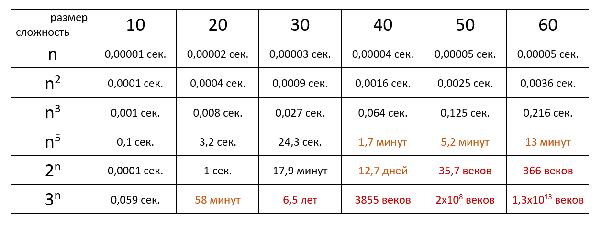

# Лекция 1.  Массивы, вычислительная сложность, тестирование.

Алгоритм должен быть **корректным**, то есть завершаться получением правильного ответа для задачи. Если алгоритм корректен, то имеет смысл говорить о том, насколько эффективно он использует предоставляемые ему ресурсы. 

Алгоритмы обычно оценивают по **времени выполнения** и по используемой **памяти**. 

Такие оценки называют **вычислительной сложностью** алгоритма. Чем выше вычислительная сложность, тем дольше работает алгоритм и/или больше памяти использует. 

Выделяют два вида сложности: **временнАя сложность (time complexity)** и **пространственная сложность (space complexity)**.

В отличие от корректности алгоритма, которая не зависит от конкретного компьютера, выполняющего алгоритм, фактическое время работы алгоритма зависит от:

- скорости работы компьютера
- языка программирования, на котором реализован алгоритм
- компилятора или интерпретатора, который переводит программу в исполняемый код,
- опыта разрабатывающего программу программиста
- параллельно выполняемых компьютером задач

#TODO: Добавить пример про wallclock time и cpu time

Все эти факторы являются внешними по отношению к самому алгоритму.

**Как оценить эффективность алгоритма, а не реализации?**

**Идея 1** 
Привязка оценки эффективности алгоритма к размеру используемых им входных данных и самим данным.

**Идея 2** 
Использование  ”элементарных” операций для подсчета времени работы алгоритма.  Элементарными можно считать арифметические операции, ввод-вывод, условный оператор, работу с переменными.

**Идея 3** 
Оценка скорости роста количества операций от размера входных данных. Пренебрежение менее значимыми компонентами и константами.

Допустим, алгоритм выполняет 5n3 + 4n + 3 элементарных операций на входе размера n. Мы можем отбросить слагаемые 4n и 3, которые при больших n вносят очень маленький вклад в значение функции. Более того, мы можем отбросить и множитель 5 в старшем слагаемом (через несколько лет компьютеры станут в пять раз быстрее) и сказать, что время работы алгоритма есть O(n3).

### O - символика

**Изображение 1.0 - BigO пример**

**Источник: -**

Пусть есть два алгоритма. Первый выполняет f = n2 операций, а второй g =2n + 20 операций. Какой из них лучше?

**Изображение 1.0 - BigO тест**

**Источник: -**

Обозначение O(f) можно считать аналогом математической операции ≤
Для ≥ и = приняты следующие обозначения:

f = Ω(g) – (омега, f растет не медленнее g с точностью до константы), g = O(f)
f = ϴ(g) – (тета, f и g имеют одинаковый порядок роста), f = O(g) и g = O(f)

Правила работы с O символикой

![[bigo_rules.png]]

**Изображение 1.0 - График сложностей**

**Источник: -**

### Классы сложности алгоритмов

Пример сложности вычислений при фиксированном числе операций в секунду (10^6)

**Изображение 1.0 - Таблица классов сложности алгоритмов **

**Источник: -**

